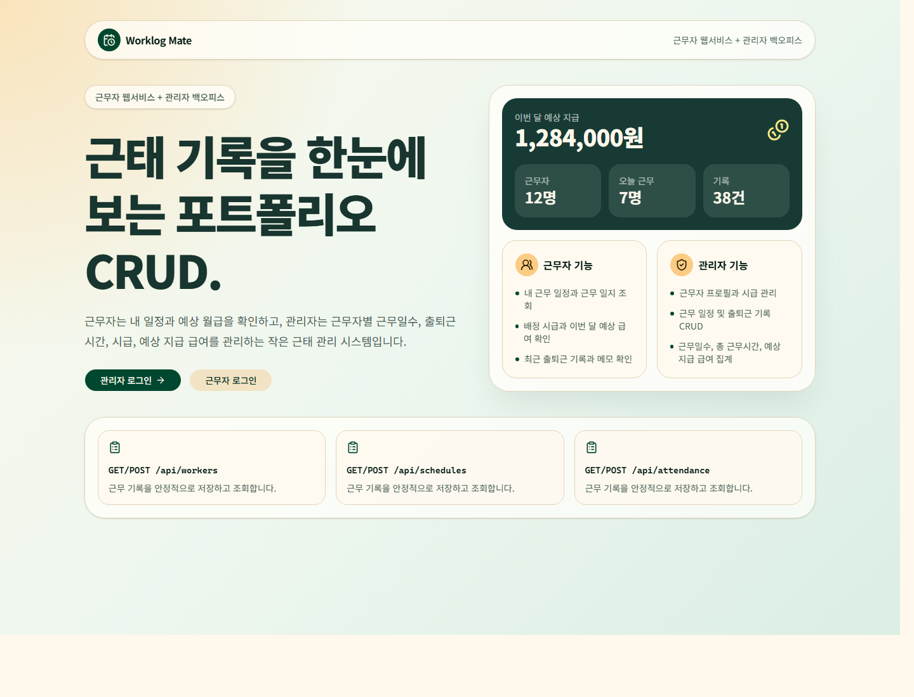
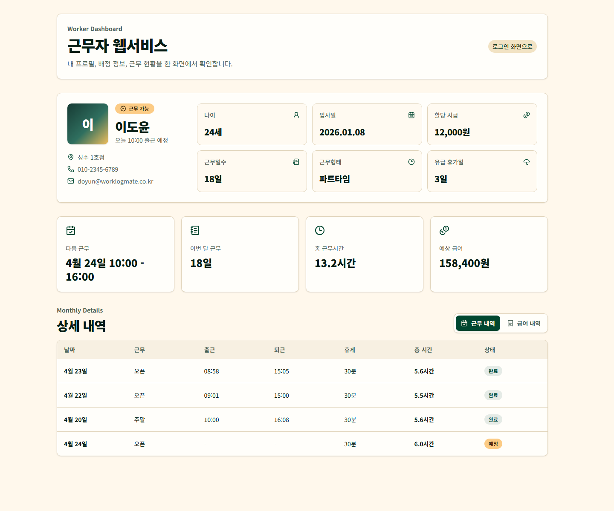
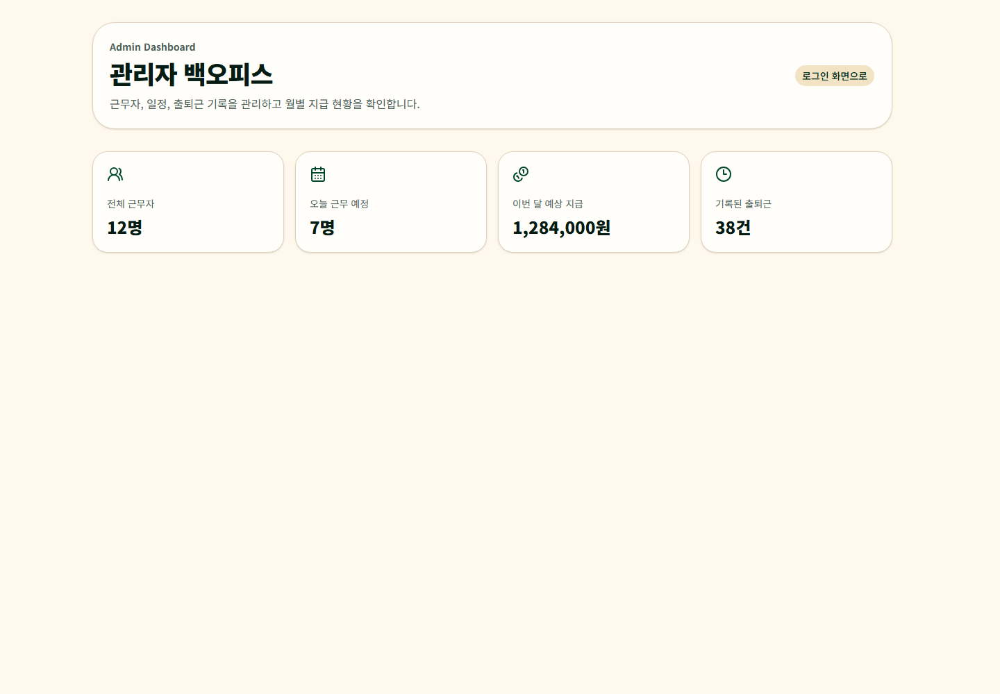

# Worklog Mate

근무자 기록을 더 쉽게 확인하고 관리하기 위한 **근태 관리 포트폴리오 프로젝트**입니다.  
근무자용 웹서비스와 관리자용 백오피스를 분리해서, 실제 업무 서비스처럼 역할별 화면과 CRUD 흐름을 보여주는 것을 목표로 합니다.

## 기획 배경

처음에는 단순 CRUD보다 조금 더 실무에 가까운 주제를 고민했고, 근무자 기록 관리 웹서비스가 포트폴리오용으로 적당하다고 판단했습니다.

이 프로젝트는 근무자가 자신의 근무 정보와 예상 급여를 확인하고, 관리자가 근무자별 출퇴근 기록과 시급, 지급 예정 급여를 관리하는 작은 근태 관리 시스템입니다.

## 화면 미리보기

### 메인 화면



### 근무자 대시보드



### 관리자 대시보드



## 서비스 구성

### 1. 근무자용 웹서비스

근무자는 본인에게 배정된 근무 정보와 급여 관련 정보를 확인할 수 있습니다.

- 내 근무 일지 조회
- 배정 받은 근무일 조회
- 나에게 배정된 시급 확인
- 이번 달 예상 월 급여 확인
- 최근 출퇴근 기록 확인

### 2. 관리자용 백오피스

관리자는 근무자별 근태 정보와 급여 계산에 필요한 데이터를 관리할 수 있습니다.

- 근무자별 프로필 관리
- 근무자별 근무일수 확인
- 출퇴근 시간 관리
- 배정 시급 관리
- 근무자별 총 근무시간 계산
- 근무자별 예상 지급 급여 확인

## 주요 기능 범위

- 근무자 프로필 CRUD
- 근무 일정 CRUD
- 출퇴근 기록 CRUD
- 근무자별 총 근무시간 계산
- 근무자별 예상 급여 계산
- 근무자용 화면과 관리자용 화면 분리
- Zod 기반 API 요청값 검증
- SQLite seed 데이터 기반 로컬 시연

## 기술 스택

- Next.js 16
- App Router
- Turbopack
- TypeScript
- Tailwind CSS v4
- shadcn/ui
- Prisma
- SQLite
- Zod
- React Hook Form
- sonner
- lucide-react
- motion

## 프로젝트 구조

```text
src/
  app/
    api/
      attendance/
      schedules/
      workers/
    page.tsx
    layout.tsx
    globals.css
  components/
    ui/
  lib/
    payroll.ts
    prisma.ts
    validations.ts
prisma/
  schema.prisma
  seed.ts
```

## API 초안

### 근무자

- `GET /api/workers`
- `POST /api/workers`

### 근무 일정

- `GET /api/schedules`
- `POST /api/schedules`

### 출퇴근 기록

- `GET /api/attendance`
- `POST /api/attendance`

## 데이터 모델

현재 Prisma 스키마는 다음 도메인을 기준으로 구성되어 있습니다.

- `User`: 관리자/근무자 계정과 프로필 정보
- `WorkSchedule`: 근무자별 배정 근무 일정
- `Attendance`: 실제 출퇴근 기록

예상 급여는 출퇴근 기록의 총 근무시간과 근무자별 시급을 기반으로 계산합니다.

## 로컬 실행

PowerShell 환경에서 `npm` 실행 정책 오류가 날 수 있어, 이 프로젝트 문서에서는 `npm.cmd` 기준으로 안내합니다.

```bash
npm.cmd install
npm.cmd run prisma:generate
npm.cmd run db:push
npm.cmd run db:seed
npm.cmd run dev
```

개발 서버 실행 후 브라우저에서 접속합니다.

```text
http://localhost:3000
```

## Prisma

SQLite DB 파일은 `prisma/dev.db`에 생성됩니다.  
`.env`에는 다음 값이 들어갑니다.

```bash
DATABASE_URL="file:./dev.db"
```

스키마를 DB에 반영하려면 다음 명령을 사용합니다.

```bash
npm.cmd run db:push
```

seed 데이터를 다시 넣고 싶다면 다음 명령을 실행합니다.

```bash
npm.cmd run db:seed
```

## 개발 메모

- 포트폴리오용 로컬 프로젝트라 GitHub Pages 배포보다는 GitHub 저장소 공개와 로컬 실행 시연을 기준으로 합니다.
- API Route Handler를 사용해 간단한 CRUD를 처리합니다.
- 복잡한 인증은 후순위로 두고, 먼저 관리자/근무자 화면과 데이터 흐름 완성도를 우선합니다.
- Prisma 7은 현재 로컬 Windows 환경에서 SQLite schema engine 오류가 있어 안정적인 개발을 위해 Prisma 6 라인을 사용합니다.

## 다음 작업 후보

1. 관리자 대시보드 화면 만들기
2. 근무자 대시보드 화면 만들기
3. 근무자 목록 테이블 만들기
4. 근무 일정 등록/수정/삭제 폼 만들기
5. 출퇴근 기록 등록/수정/삭제 폼 만들기
6. 간단한 관리자/근무자 사용자 전환 만들기

## 기타

오랜만에 next를 쓰다보니 디자인프레임워크부터 문법까지 하나같이 너무 어렵다.
